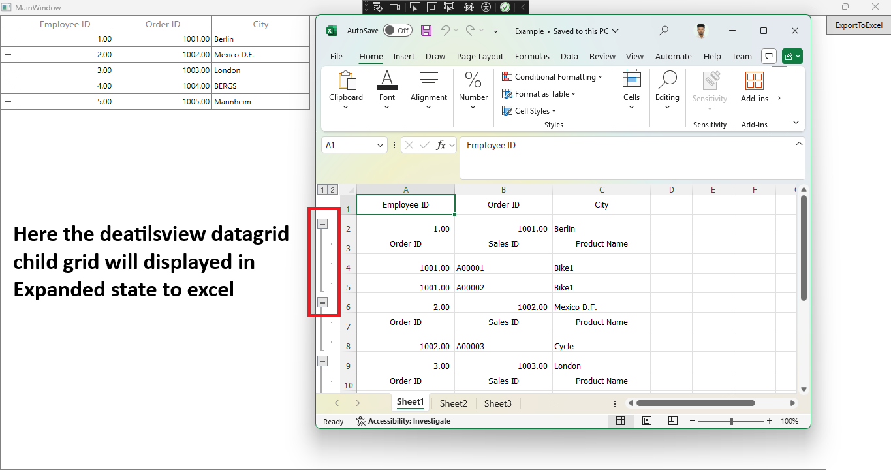

# How to export DetailsView records in expanded state from WPF DataGrid

You can export [WPF DataGrid](https://www.syncfusion.com/wpf-controls/datagrid) (SfDataGrid) to excel and it is possible to process the exported excel file using XlsIO. For example, you can expand the details view records in exported excel file alone by calling Range.ExpandGroup method for worksheet.

```C#
ExcelExportingOptions exportoption = new ExcelExportingOptions();
var excelengine = datagrid.ExportToExcel(datagrid.View, exportoption);
var workbook = excelengine.Excel.Workbooks[0];
workbook.Worksheets[0].Range.ExpandGroup(ExcelGroupBy.ByRows, ExpandCollapseFlags.IncludeSubgroups);
```

In the below screen shot, DetailsView DataGrid expanded only in excel file and not in SfDataGrid.



